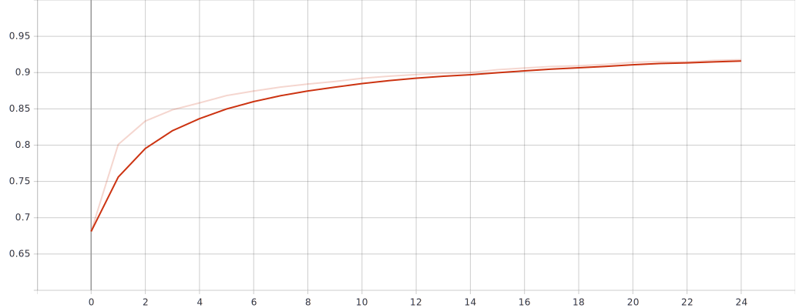
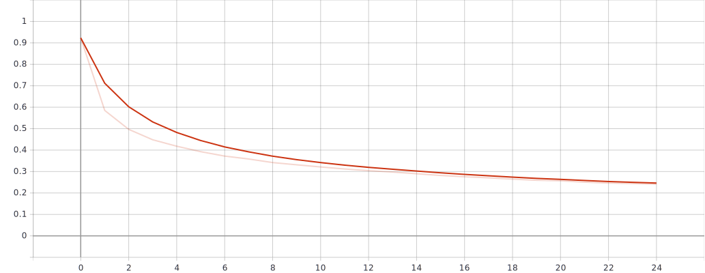

# ζ-C1
Team ζ's submission to the AI Club's first challenge (zeta-c1). The network uses convolutional layers to capture multi-scalar features in the Fashion MNIST database.
## Performance
### Network Accuracy

### Network Loss

